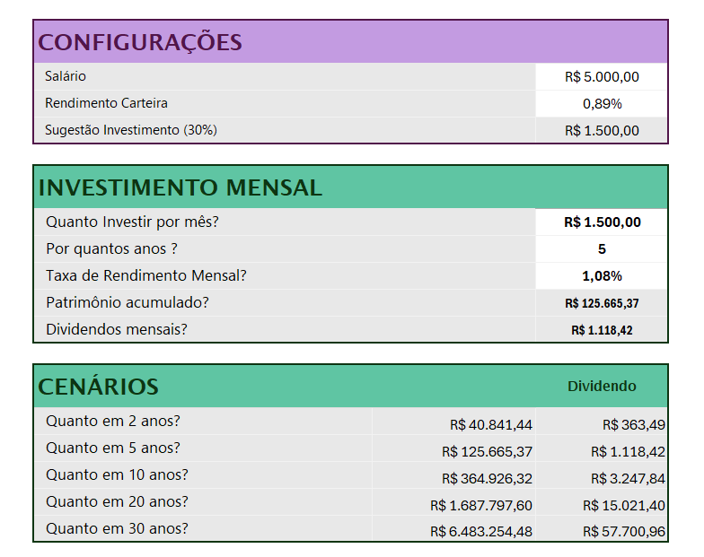
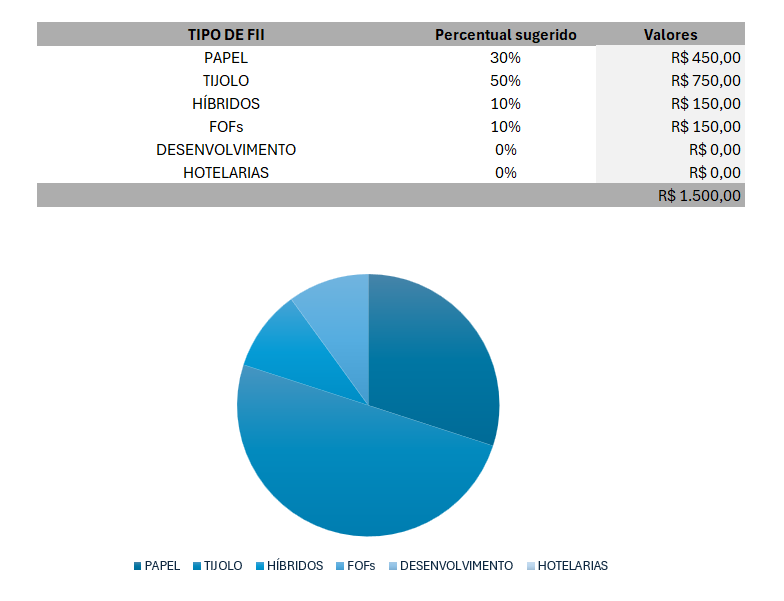

# 📊 Simulador de Investimentos - Excel

## 📌 Sobre o projeto

Simulador de investimentos desenvolvido no Excel como projeto prático de um curso.

## 📊 Visualização do projeto

## 🎯 Objetivo

Simular a evolução de investimentos mensais, permitindo visualizar o patrimônio acumulado, os dividendos estimados e diferentes cenários ao longo do tempo.

## ⚙️ Funcionalidades

- Cálculo do investimento mensal;
- Projeção do patrimônio em diferentes períodos;
- Estimativa de dividendos mensais;
- Sugestão de distribuição da carteira;
- Gráfico de distribuição dos investimentos.

## 🛠️ Ferramentas utilizadas

- Microsoft Excel;
- Fórmulas e funções;
- Cálculos financeiros;
- Gráficos.

## 📈 Como funciona

O usuário informa dados como salário, valor a investir, período e taxa de rendimento. A partir dessas informações, o Excel realiza os cálculos e apresenta as projeções e a distribuição sugerida da carteira.

## 📁 Arquivo

[📊 Baixar o Simulador de Investimentos](./Projeto_Simulador_Investimentos.xlsx)

> Os valores apresentados são apenas simulações e não representam garantia de rentabilidade.
